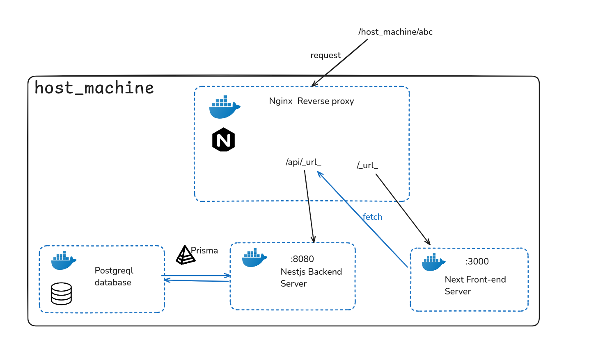
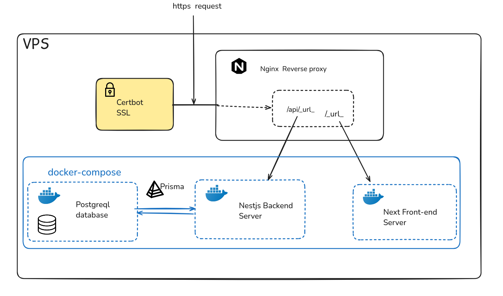
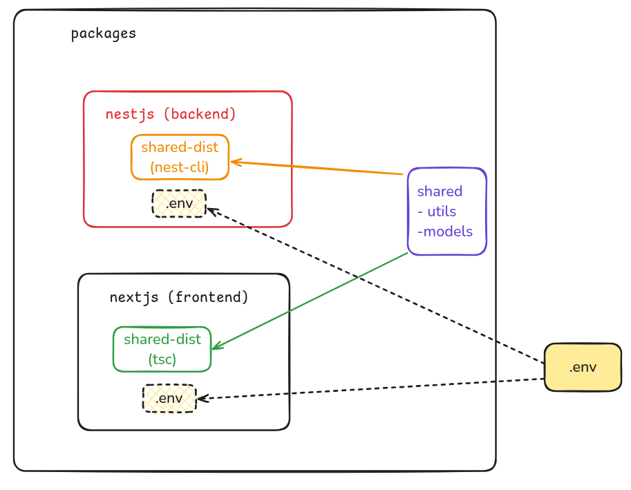

# Apprentis

> A diary for the apprentisage to track down activiy, mission and interact with INSA tutor, company

**Admin credentials on prod**: 

        * admin@insa.fr 
        * admin

## To test the app on your local machine

You first need to create an **.env** file that contain these parameter:
```
# You can change the database_url, however it need to match the config inside docker compose.

DATABASE_URL="postgresql://mono:postgres@db:5432/app-mono?schema=public"

JWT_SECRET="mysecretkey@@@@123"
JWT_EXPIRE=14d

# 30 days
COOKIE_EXPIRE=2592000000
```
Then you can use the **runner** script to launch the app, (it is advised that you use a linux instance that has installed docker with non-root user access)

[Link for install Docker](https://docs.docker.com/engine/install/)

[Non-root access ](https://docs.docker.com/engine/install/linux-postinstall/)

## Table of Content
* [I. Project objective](#objective)
* [II. Global infrastructure](#infrastructure)
* [III. Pnpm package manager](#package-manager)
* [IV. Nestjs Backend](#backend)
* [V. Nextjs Frontend](#frontend)

## Objective

The project main goal is to create un web interface so that:
* Company can asign mission to an apprentice.
* Apprentice then can track their working progress by adding activies to their given missions. Along side with auto-evaluation of skill. Also they have access to an overall graph of their evaluated skills.
* The INSA tutor then can evaluate the skill off the apprentice
* Giving feedback to the apprentice's activities by both company and tutor.

## Infrastructure

### Dev mode 

On the development environment (local). We will define 4 containers:
* Backend service
* Frontend service
* Database
* Nginx proxy

From here Nginx reverse proxy will play role of a traffic controller, which will separate the requests arriving at the host machine:
* Requests with a /api surfix will be forwarded to the backend
* All others are treated as a request for an html page, so it arrives at the frontend service

### Production mode

On production we won't change much, however. The nginx proxy now should be installed as a service on the **VPS** or the **production instance**
handling all the traffics.

For postgreql database. Here I also use a container since my VPS will have many other service, so by this I can achieve separation of concern between databases. However running postgreql on container is not advised and should only be use as an concept. A dedicated machine should be use as a database.

An Certbot is also installed to issue CA to the nginx proxy, along side with a cronjob to auto renew the certificate every 60 day.

## Package manager


Here I have choose to setup the project as a monorepo, which mean that both backend and frontend will be on the same hosting, and also on the same repo.

For this I have choose pnpm since it have workspace that help me including a shared package ( models, utils, etc) that will be included to both backend and frontend node_modules as a private packages.

I opting for having two separated building dist for frontend and backend, since my nestjs required to be compiled with nest-cli so that the shared models files work correctly with nest. However these feature is not needed for Next and React, therefore 2 build method is used, resulting in two different dist.

You can also further elevate this with more crazy config like using a lot of decorators for Nestjs and then get it all stripped when build it for frontend, making sure that it can be compatible for both.

## Backend

With Nestjs, a simple jwt authentification with cookies is setup. To enforce restriction on certain APIs endpoint, custom decorators and Nest guard have been implementeds

## Frontend

Nextjs is used along with Mantine UI to make responsive designing much easier and faster. An middleware is setup to intercepting request to an route, preventing unwanted access for user to route that require higher privledge. 


